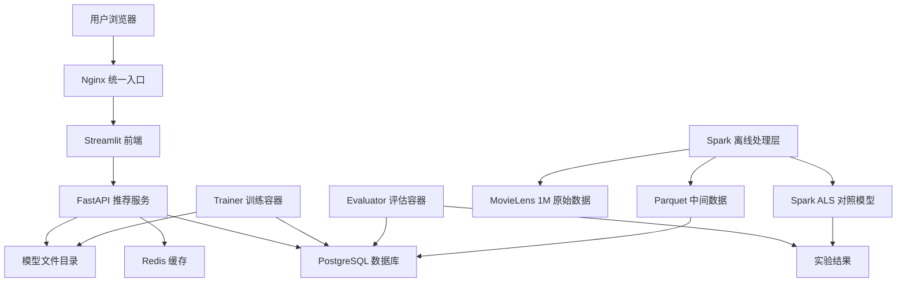

# Movie Cloud Recommender

基于容器化微服务与混合推荐算法的云端电影推荐系统设计与实现。

本项目由原始 FastAPI Movie Recommender demo 重构而来，最终主线固定为：

- MovieLens 32M 主数据集，MovieLens 1M 可作为开发验证集
- FastAPI 在线推荐服务
- Streamlit 前端展示
- PostgreSQL 数据持久化
- Redis 推荐缓存
- implicit ALS/BPR 在线推荐核心
- RecBole 离线评估
- Spark MLlib ALS 分布式对照实验
- Docker Compose 多容器部署
- Nginx 统一入口

## Architecture



## Project Structure

```text
backend/        FastAPI API、数据库模型、推荐服务
frontend/       Streamlit 前端
trainer/        implicit ALS/BPR 训练脚本
evaluator/      自定义评估与 RecBole 配置
spark/          Spark 预处理与 Spark MLlib ALS
nginx/          统一入口反向代理
data/           raw/processed/parquet 数据目录
models/         implicit 与 Spark 模型产物
docs/           论文与实验文档
```

旧版 `myapp/`、`streamlit-app.py`、`sql_load.py` 保留为历史参考；最终运行入口使用新目录。

## Quick Start

启动核心服务：

```bash
docker compose up -d --build
docker compose ps
curl http://127.0.0.1:8000/health
```

访问：

```text
FastAPI:   http://127.0.0.1:8000/docs
Streamlit: http://127.0.0.1:8501
```

启用 Nginx 统一入口：

```bash
docker compose --profile edge up -d nginx
curl http://127.0.0.1:8080/api/health
```

## Dataset Choice

推荐使用 **MovieLens 32M** 作为最终论文/实验主数据集。它是 GroupLens 当前推荐用于新研究的稳定 benchmark，规模大且版本固定，更适合写论文结果。

也支持 **MovieLens Latest Full**。但 GroupLens 官方说明 latest 数据集会随时间变化，不适合报告固定 research results，更适合作为教育、开发和系统压力测试数据。

建议实践方式：

```text
开发调试：MovieLens 1M
最终实验：MovieLens 32M
系统压力测试/最新数据体验：MovieLens Latest Full
```

## Import MovieLens

如果你刚更新过导入脚本或代码，需要先重建后端镜像，否则容器里仍然是旧代码：

```bash
docker compose up -d --build backend
```

### MovieLens 1M

将 MovieLens 1M 解压到：

```text
data/raw/ml-1m/users.dat
data/raw/ml-1m/movies.dat
data/raw/ml-1m/ratings.dat
```

导入 PostgreSQL：

```bash
docker compose exec backend python -m app.db.import_movielens --data-dir /data/raw/ml-1m
```

预期规模：

```text
users   6040
movies  3883
ratings 1000209
```

### MovieLens 32M

将 MovieLens 32M 解压到：

```text
data/raw/ml-32m/movies.csv
data/raw/ml-32m/ratings.csv
data/raw/ml-32m/tags.csv
data/raw/ml-32m/links.csv
```

导入 PostgreSQL：

```bash
docker compose exec backend python -m app.db.import_movielens --data-dir /data/raw/ml-32m --dataset 32m
```

也可以省略 `--dataset 32m`，脚本会根据 `movies.csv` 和 `ratings.csv` 自动识别：

```bash
docker compose exec backend python -m app.db.import_movielens --data-dir /data/raw/ml-32m
```

MovieLens 32M 没有 `users.dat` 人口统计文件，导入脚本会从 `ratings.csv` 的 `userId` 自动生成 `users` 表。

### MovieLens Latest Full

将 `ml-latest.zip` 解压到：

```text
data/raw/ml-latest/movies.csv
data/raw/ml-latest/ratings.csv
data/raw/ml-latest/tags.csv
data/raw/ml-latest/links.csv
data/raw/ml-latest/genome-scores.csv
data/raw/ml-latest/genome-tags.csv
```

导入 PostgreSQL：

```bash
docker compose exec backend python -m app.db.import_movielens --data-dir /data/raw/ml-latest --dataset latest
```

如果只想先导入主推荐链路，跳过较大的 `tags.csv`：

```bash
docker compose exec backend python -m app.db.import_movielens --data-dir /data/raw/ml-latest --dataset latest --skip-tags
```

导入器会处理：

```text
movies.csv
ratings.csv
links.csv
tags.csv 可选
```

`genome-scores.csv` 和 `genome-tags.csv` 暂不进入在线推荐链路，后续可作为内容特征增强实验。

不要把这些路径说明直接粘到终端执行：

```text
data/raw/ml-32m/movies.csv
data/raw/ml-32m/ratings.csv
data/raw/ml-32m/tags.csv
data/raw/ml-32m/links.csv
```

它们只是文件应该放置的位置。终端里需要执行的是上面的 `docker compose exec ...` 导入命令。

## API

Legacy parity mode:

```text
GET  /movies?limit=100
GET  /movies/search?q=toy&limit=50
GET  /recommend/movie?movie_id=1&limit=4
POST /clicks
GET  /clicks/{movie_id}
POST /movies
```

Advanced recommendation mode:

```text
GET  /health
GET  /recommend/popular?limit=10
GET  /recommend/user/{user_id}?limit=10
GET  /recommend/similar/{movie_id}?limit=10
GET  /recommend/hybrid/{user_id}?seed_movie_id={movie_id}&limit=10
POST /events
GET  /metrics/cache
GET  /metrics/system
GET  /evaluation/summary?sample_size=20&k=10
```

示例：

```bash
curl "http://127.0.0.1:8000/movies/search?q=toy"
curl "http://127.0.0.1:8000/recommend/movie?movie_id=1&limit=4"
curl -X POST http://127.0.0.1:8000/clicks \
  -H "Content-Type: application/json" \
  -d '{"movie_id":318}'
curl "http://127.0.0.1:8000/clicks/318"
curl "http://127.0.0.1:8000/recommend/popular?limit=10"
curl "http://127.0.0.1:8000/recommend/similar/1?limit=10"
curl "http://127.0.0.1:8000/recommend/user/1?limit=10"
curl "http://127.0.0.1:8000/recommend/hybrid/1?seed_movie_id=1&limit=10"
curl "http://127.0.0.1:8000/evaluation/summary?sample_size=20&k=10"
curl -X POST http://127.0.0.1:8000/events \
  -H "Content-Type: application/json" \
  -d '{"user_id":1,"movie_id":1,"event_type":"click","event_value":1}'
```

## Evaluation Page

Streamlit includes an `Evaluation` tab. It runs a sampled leave-one-out evaluation:

```text
seed movie = one movie liked by a sampled user
target movie = another liked movie from the same user
hit = target appears in Top-K recommendations
```

Displayed metrics:

```text
Precision@K
Recall@K
NDCG@K
HitRate@K
Average latency
p95 latency
```

The displayed CTR is `Demo CTR`, based only on local recommendation impressions and clicks inside this demo. It is not claimed as production user CTR.

## Train Models

```bash
docker compose --profile training run --rm trainer python train_als.py
docker compose --profile training run --rm trainer python train_bpr.py
ls -lh models/
```

输出：

```text
models/implicit_als.joblib
models/implicit_bpr.joblib
```

在线接口会优先使用 `implicit_als.joblib`；缺失时自动回退到共现推荐或热门推荐。

## Evaluation

自定义基线评估：

```bash
docker compose --profile experiments run --rm evaluator python evaluate_custom.py
```

RecBole BPR：

```bash
docker compose --profile experiments run --rm evaluator \
  python -m recbole.quick_start.run_recbole \
  --model=BPR \
  --dataset=ml-1m \
  --config_files=/app/recbole/bpr_ml1m.yaml
```

结果目录：

```text
evaluator/results/
```

## Spark

```bash
docker compose --profile spark up -d spark-master spark-worker spark-job
docker compose --profile spark exec spark-job spark-submit /app/preprocess_movielens.py
docker compose --profile spark exec spark-job spark-submit /app/train_spark_als.py
```

Spark 只用于离线对照实验，不参与在线请求链路。

## Hybrid Formula

```text
FinalScore(u, i)
= 0.60 * CFScore(u, i)
+ 0.20 * ContentScore(u, i)
+ 0.10 * PopularityScore(i)
+ 0.10 * RecentBehaviorScore(u, i)
```

## Acceptance Checklist

- [ ] `docker compose up -d --build` 成功
- [ ] `GET /health` 返回 `ok`
- [ ] Streamlit 可访问推荐页面
- [ ] MovieLens 1M 导入 PostgreSQL
- [ ] 电影搜索/选择可用
- [ ] `/recommend/movie?movie_id=1&limit=4` 返回相似电影
- [ ] 点击按钮后点击率可变化
- [ ] Evaluation tab 能展示 Precision/Recall/NDCG/HitRate 与延迟
- [ ] Redis 出现 `recommend:*` 缓存 key
- [ ] Popular、Item-CF、User CF、Hybrid 接口可用
- [ ] ALS/BPR 模型可训练并保存
- [ ] RecBole 或自定义评估输出结果
- [ ] Spark ALS 对照实验可运行
- [ ] Nginx 统一入口可访问

## Out of Scope

不做 Kubernetes、Kafka、Spark Streaming、实时流推荐、复杂登录注册、大模型推荐、豆瓣爬虫、TMDB 主流程。
